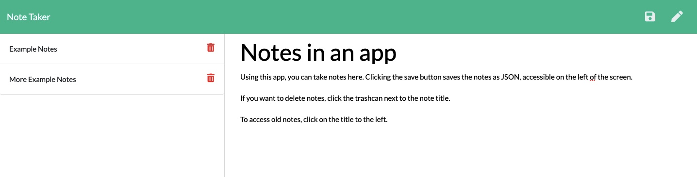

# Note Taker

## Description
An app for writing and saving notes. This app uses Express.js to save, retrieve, and delete note data from a JSON file. The front end is HTML, CSS, and JavaScript.

On the right of the app, users can add a title and body of their note. When they click the save icon, the notes are saved on the left. Users can access old notes by clicking the title of the note. Clicking the trashcan icon deletes the saved notes. 

Here is a screenshot of the note taker: 

## Table of Contents
* [Installation](#installation)
* [Usage](#usage)
* [License](#license)

## Installation
To install dependencies, run the following:
`
npm install
`

## Usage
Express and uuid packages are used to run this script, you need to install them locally to run this code locally. The main file is server.js. The routes folders contains the express.js code, routing the API and HTML. The assets folder contains the HTML files, CSS stylesheet, and JavaScript index file.

## License
This repository is licensed under the MIT: (https://opensource.org/licenses/MIT) license.

